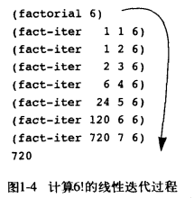
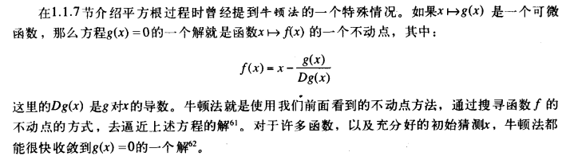
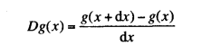

## SICP chapter1

选择 Lisp 的原因：计算过程的 Lisp 描述（称为过程）本身又可以作为 Lisp 的数据来表示和操作。而现存的很多程序设计技术，都依赖于填平“被动的”数据和“主动的”过程之间的传统划分。


### 正则序求值和应用序求值

正则序求值：完全展开 procedure 后再代入值

应用序求值：先代入参数而后应用（可以避免对表达式的重复求值）

### 函数与过程的矛盾

函数与过程的矛盾，表现在描述一件事情的特征，与描述如何去做这件事情之间的差异。

譬如平方根在数学中的定义往往是阐明是什么，但计算机中更关心的是如何去求出这个平方根。


### 递归与迭代

在 lec1b 中提到的栗子可以看到

迭代：time: O(x) space :O(1)

```scheme
; peano arithmetic
(define o+
    (lambda (x y) 
        (cond 
            ((= 0 x) y)
            (else (o+ (sub1 x) (add1 y)) ))))
```

递归：time: O(x) space :O(x)

```scheme
(define o+2
    (lambda (x y) 
        (cond 
            ((= 0 x) y)
            (else (add1 (o+2 (sub1 x) y)) ))))
```


递归过程和递归计算过程区分

上面的 `o+ ` 是递归过程的，但是将产生的是迭代的计算过程。迭代的计算过程指的是：在计算过程中的任意一点，那几个程序变量都提供了有关计算状态的一个完整描述。

> 当我们说一个过程是递归时，指的是语法形式上的事实，说明在这个过程的定义中，直接或间接的引用了该过程本身。
>
> 可以使用 [`(require racket/trace)`](https://docs.racket-lang.org/reference/debugging.html) 调用 `(trace fact-iter)` trace + 函数名 在解释器里面追踪两个 `plus` 函数的不同定义来考察它们所使用的计算模式




```scheme
#lang racket
(define (square x)
    (* x x))

(define (average x y)
    (/ (+ x y) 2))

(define (improve guess x)
    (average guess (/ x guess)))

(define (good-enough? guess x)
    (< (abs (- (square guess) x))
            0.001))


(define (sqrt-iter guess x)
    (if (good-enough? guess x)
        guess
        (sqrt-iter (improve guess x) x)))


(define (sqrt x)
    (sqrt-iter 1.0 x))

(sqrt 9)
(sqrt 137)
```


### common pattern

#### 不动点求值

若 `f(x)=x `， 那么 x 称为函数 f 的不动点

```scheme
(define (fixed-point f first-guess)
    (define (close-enough? x y)
        (< (abs (- x y)) 0.0001))
    (define (try guess)
        (let ((next (f guess)))
            (if (close-enough? guess next)
                guess
                (try next))))
    (try first-guess))

(fixed-point cos 1.0)
(fixed-point 
    (lambda (x) (+ (sin x) (cos x)))
    1.0)
```

此时我们发现上面步骤和 `sqrt.rkt` 中的求值 `sqrt` 很像，因此可以将找平方根的计算过程转换为找不动点

> 推导过程如下：
>
> sqrt: y^2=x -> y=x/y -> 此时即找该函数的不动点

```scheme
(define (sqrt x)
    (fixed-point
        (lambda (y) (/ x y))
        1.0))
; (sqrt 100)        ; 死循环
```

我们发现当计算时，可能会存在：某个初始猜测为 y1，下一个猜测即为 y2=x/y1，那么再下一个猜测为 y3=x/y2=y1，因此不收敛，进入无限循环

即问题在于推导可知会产生振荡，而控制振荡的方式是不让猜测变化的太剧烈

因此此处使 y=x/y 猜测 1/2(x/y) 而非 (x/y)

```scheme
(define (sqrt2 x)
    (fixed-point
        (lambda (y) (average y (/ x y)))
        1.0))

(sqrt2 100)
```


#### 将过程作为返回值

再修改一下，平均阻尼实现为下面过程：

可看到，参数是一个过程 f ，返回值是另一个通过 `lambda` 产生的过程。

```scheme
(define (average-damp f)
    (lambda (x) (average x (f x))))
((average-damp square) 10)		; 55
```

重写平方根如下：

```scheme
(define (sqrt x)
    (fixed-point
        (average-damp 
            (lambda (y) (/ x y)))
        1.0))
```

注意上述过程中，存在：**用函数作为参数的高阶过程。**

当需要传入参数为函数时，诸如下方代码

```
(average-damp f x)
```

以下写法与上面等价，但是我们发现，会存在一个 `foo` 的冗余变量名。

```scheme
(define (average-damp f)
    (define (foo x)
        (average x (f x)))
    foo)
```


#### 牛顿法求值



```scheme
(define (newton g guess)
    (fixed-point (newton-transform g) guess))

; 现在再表示牛顿法
(define (newton-transform g)
    (lambda (x) 
        (- x (/ (g x) ((deriv g) x)))))
```

而上面提到的 `deriv g` 即为导数的实现



```scheme
; g(x+dx)-g(x) / dx
(define (deriv g)
    (lambda (x) 
        (/ (- (g (+ x dx)) (g x))
            dx)))
(define dx 0.000001)
```

那么现在就可以根据牛顿法给出 `sqrt` 的另一种实现方式

```scheme
(define (sqrt x)
    (newton (lambda (y) (- (square y) x))
            1.0))

(sqrt 100)
```

#### 抽象和 first-class 

可以看到上面两种方式将平方根表述为更一般的实例，一为作为不动点的搜寻过程，二为使用牛顿法。而牛顿法的实质也即为不动点的计算，因此可概之两种方法实则都是**从一个函数出发，找出该函数在某个变换下的不动点。**

因此可以再次进行一个抽象

```scheme
(define (fixed-point-of-transform g transform guess)
    (fixed-point (transform g) guess))
```

重新塑造两种方法的平方根：

```scheme
(define (sqrt x)
    (fixed-point-of-transform 
        (lambda (y) (/ x y))
        average-damp
        1.0))

(define (sqrt x)
    (fixed-point-of-transform 
        (lambda (y) (- (square y) x))
        newton-transform
        1.0))
```

**first class element**

一般而言，程序设计语言总会对计算元素的可能使用方式强加上某些限制。带有最少限制的元素被称为具有第一级的状态。第一级元素具有某些“权利或者特权”包括:

- 可以用变量命名;
- 可以提供过程作为参数;
- 可以由过程作为结果返回；
- 可以包含在数据结构中。


