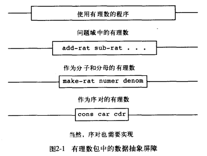

## 构造抽象数据

数据抽象的基本思想，就是我们的程序在使用数据时，除了完成当前工作所必要的东西以外，不对任何所用的数据进行多余的假设，使其就像在”抽象数据“上操作一样。


构造函数和选择函数形成抽象屏障。



在此栗子中，make-rat 为构造函数，number 和 demon 为选择函数。

通过 `cons` 来进行序对的表示。

在 `make` 时进行规约，使形成最简形式。

```scheme
(define (make-rat n d) 
    (let ((g (gcd n d)))
        (cons (/ n g) (/ d g))))
    
(define (number x) (car x))
; denominator
(define (denom x) (cdr x))
```

使用 `print` 函数进行展示

```scheme
(define (print-rat x)
    (display (number x))
    (display "/")
    (display (denom x))
    (newline))
```

那么实现有理数的加法也如下：在 `make` 时进行规约，就不用在 `add` 时再进行规约。

```scheme
(define (add-rat x y)
    (make-rat (+ (* (number x) (denom y)) 
                (* (number y) (denom x)))
                (* (denom y) (denom x))))
```

