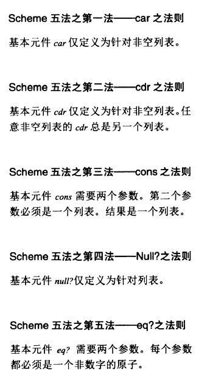
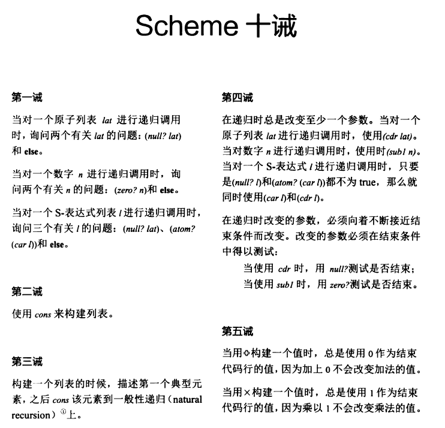
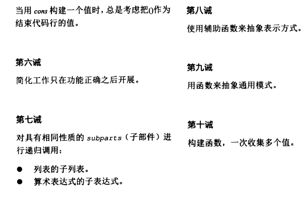
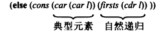

# 五法十诫

[代码实现](https://github.com/pkrumins/the-little-schemer)

## 五法



### 一、`car` 仅针对非空列表

```scheme
> (cdr '(1))
'()
> (car '(1))
1
```

### 二、`cdr` 仅针对非空列表

cdr 的发音是 “could-er"， 且 cdr 的结果为**另一个列表**。

### 三、cons 第二个参数是任意**列表**，且结果为一个列表

cons 有两个参数，第一个参数是任意的 S-表达式，第二个参数是任意**列表**。

```scheme
> (cons '(1 2 3) '(4 5 6))
'((1 2 3) 4 5 6)
> (cons '(1 2 3) '())
'((1 2 3))
```

### 四、Null? 仅针对列表

```scheme
> (null? '())
#t
```

### 五、eq? 需要两个参数，每个参数都必须是一个原子

首先实现一个判断 `atom` 的函数

```scheme
#lang racket
(define atom?
    (lambda (x) 
        (and (not (pair? x)) (not (null? x)))))

(atom? "aa")
```


## 十诫





### 一、在表达任意函数时，总是将询问 null? 作为问题之首

- 在对一个原子列表 lat 进行递归调用时，询问 `(null?lat) 和 else`
- 在对一个数字 n 进行递归调用时，询问 `(zero?n) 和 else`
- 在对一个 S-表达式列表 l 进行递归调用时，询问三个有关 l 的问题：`(null? lat)、(atom? (car l)) 和 else`

#### lat?

```scheme
(define lat?
    (lambda (l) 
        (cond 
            ((null? l) #t)
            ((atom? (car l)) (lat? (cdr l)))
            (else #f))))

(lat? '(1 2 3))
```

#### member?

```scheme
; 判断 a 是否为 lat 的成员
(define member?
    (lambda (a lat) 
        (cond
            ((null? lat) #f)
            (else (or (eq? a (car lat))
                            (member? a (cdr lat)))))))

(member? 1 '(1 2 3))
(member? "a" '("a" "b" "c"))
```

#### rember

```scheme
; 从 lat 中移除 a
(define rember
    (lambda (a lat)
        (cond 
            ((null? lat) '())
            (else (cond 
                    ((eq? (car lat) a) (cdr lat))
                    (else (rember a (cdr lat))))))))

(rember 1 '(1 2 3))
(rember "a" '("a" "b" "c"))
```

#### rember*

现在不仅要递归列表的 cdr， 还要递归列表的 car。

需要用 `atom` 来进行判断。

> 此处就引出了一诫中的最好一项：
>
> 在对一个 S-表达式列表 l 进行递归调用时，询问三个有关 l 的问题：`(null? lat)、(atom? (car l)) 和 else`。

```scheme
; The rember* function removes all matching atoms from an s-expression
;
(define rember*
    (lambda (a lat) 
        (cond 
            ((null? lat) '())
            ((atom? (car lat))
                (cond 
                    ((eq? (car lat) a) (rember* a (cdr lat)))
                    (else (cons (car lat)
                                (rember* a (cdr lat))) )))
            (else (cons (rember* a (car lat))           ; (car lat) 可以不为原子
                        (rember* a (cdr lat)) ) ) )))
```

### 二、使用 cons 来构建列表

#### rember2

```scheme
; cons 构建的第二版本 rember
(define rember2
    (lambda (a lat) 
        (cond 
            ((null? lat) '())
            (else (cond 
                    ((eq? (car lat) a) (cdr lat))
                    (else (cons (car lat) 
                                (rember2 a (cdr lat)))))))))
```

### 三、构建一个列表时，描述第一个典型元素，之后 cons 该元素到一般性递归中。

对于 `firsts` 这样一个函数

```scheme
>(firsts '((apple peach pumpkin)
            (plum pear cherry)
            (grape raisin pea)
            (bean carrot eggplant))) 
'(apple plum grape bean)
```

如上面可知，取列表第一个元素。

```scheme
; cons 构建的第二版本 rember
(define firsts
    (lambda (l)
        (cond 
            ((null? l) '())
            (else (cons (car (car l))
                        (firsts (cdr l)))))))
```

可以看到实现中的最后一行便正是第三诫的归纳。

[[What is the definition of "natural recursion"?](https://stackoverflow.com/questions/32260444/what-is-the-definition-of-natural-recursion)]



接着进行种种练习，包括：

`insertR` 、`insertL`、`subst`、`subst2`、`multirember`、`multiInsert`...


### 四、在递归时总是改变至少一个参数。

递归时总是改变至少一个参数。

- 当对一个原子列表 lat 进行递归调用时，使用 （cdr lat）；
- 当对数字 n 进行递归调用时，使用 （sub1 n)；
- 当对一个 S-表达式 lat 进行递归调用时，只要是 (null? lat) 和 (atom? (car lat)) 都不为 true，那么同时使用 (car lat) 和 (cdr lat)；

该参数必须向着不断接近结束条件而改变，改变的参数必须在结束条件中得以测试：比如当使用 `cdr` 时，用 `null?` 测试是否结束；当使用 `sub1` 时，用 `zero?` 测试是否结束。


## 数字的递归转换

首先介绍两个基础函数 `add1` 和 `sub1`。

```scheme
(define add1
    (lambda (n)
        (+ n 1)))
        
(define sub1
    (lambda (n)
        (- n 1)))
```

此处的 `(cond ((zero? m) n)...)  `  就类似一诫中的 `null?` 判断数字是否为空。

此处的 `(o+ m (sub1 m))` 就类似 `cons` 用于构建列表一样构建数字。

```scheme
; The o+ function adds two numbers
;
(define o+
    (lambda (m n)
        (cond 
            ((zero? m) n)       
            (else (add1 (o+ m (sub1 m)))))))
```

o- 以两个数字作为参数，并递减第二个参数 n 直到 0，n 减到 0 需要多少次，m 也就减去多少个 1，最终 m 作为结果返回。（o+ 同理来理解）

```scheme
(define o-
    (lambda (m n)
        (cond 
            ((zero? n) m)
            (else (sub1 (o- m (sub1 n))) ))))
```


- 数字定义：其要么为 0，要么为 1 加到剩余部分，而剩余部分又是一个数字。

- 针对数字的一般性递归是怎样的？		`(sub1 n)`

- 针对数字的一般性结束条件是什么？      `(zero? n)`


接着进行种种练习，包括：

- 运算符的实现：`o+` 、` o-`、`addtup`、`o*`、`tup+`、`o>`、`o<` 、` o=`、`o^`、`o/`、

- 练习题：`olength`、`pick`、`rempick`、`no-nums`、`all-nums`、`eqan?`、`occur`...


### 五、结束代码行的取舍

- 当采用 o+ 构建时，总是使用 0 作为结束代码行的值
- 当采用 o* 构建时，总是使用 1 作为结束代码行的值
- 当采用 cons 构建时，总是使用 `()` 作为结束代码行的值


### 六、简化工作只在功能正确后开展

详情见 `TheLittleScheme/chap5_stars/star*.rkt` 文件中 `eqlist` 和 `equal` 的简化过程。


 

### 七、对相同性质的 `subparts` 进行递归调用

- 列表的子列表
- 算术表达式的子表达式


## 算术表达式

### 中缀式

第六章中下个定义：算术表达式要么是一个原子（包括数字），要么是用 `+` 、`x`、`^` 连接起来的两个算术表达式。

因此对于中缀式 `(1 ^ (2 + (5 x 6)))` 可以采用诸如下面的方式，**取得相同性质表达式。**

```scheme
((eq? (car (cdr nexp)) 'o+)
	(+ (value (car nexp))
		(value (car (cdr (cdr nexp))))))
```

值得一提的是：

```scheme
(define aexp '((5 o+ 2) ox (3 o^ (5 o+ 2))))
(car aexp)
(cdr aexp)
(cdr (cdr aexp))
(car (cdr (cdr aexp)))

;------------ 其输出为：
'(5 o+ 2)
'(ox (3 o^ (5 o+ 2)))
'((3 o^ (5 o+ 2)))
'(3 o^ (5 o+ 2))
```

`(car (cdr (cdr aexp)))` 的解释：*加上 car 是因为中间的 cdr 会加上 ()*


### 前缀式

可以使用取参数和运算符的思路

```scheme
(define 1st-sub-exp
    (lambda (aexp)
        (car (cdr aexp))))

(define 2nd-sub-exp
    (lambda (aexp)
        (car (cdr (cdr aexp))) ))

(define operator
    (lambda (aexp)
        (car aexp)))
```

那么实现前缀式如下：

```scheme
(define value-prefix
    (lambda (nexp) 
        (cond 
            ((atom? nexp) nexp)
            ((eq? (operator nexp) 'o+) 
                (+ (value-prefix (1st-sub-exp nexp))
                    (value-prefix (2nd-sub-exp nexp))))
            ((eq? (operator nexp) 'ox)
                (* (value-prefix (1st-sub-exp nexp))
                    (value-prefix (2nd-sub-exp nexp))))
            ((eq? (operator nexp) 'o^)
                (expt (value-prefix (1st-sub-exp nexp))
                    (value-prefix (2nd-sub-exp nexp))))
            (else #f))))
```


### 八、使用辅助函数来抽象表达方式

上面的前缀式采用 `operator`、`1st-sub-exp` 的辅助函数进行实现，改为后缀或中缀时，只需要修改相关辅助函数的实现即可。

现在考虑以下情况：

- 选 `()` 表示 0
- 选 `(())` 表示 1
- 选 `(()())` 表示 2
- 选 `(()()())` 表示 3

```scheme
; sero? just like zero?
;
(define sero? 
    (lambda (n) 
        (null? n)))
; edd1 just like add1
;
(define edd1
    (lambda (n) 
        (cons '() n)))
; zub1 just like sub1
;
(define zub1
    (lambda (n) 
        (cdr n)))

; .+ just like o+
;
(define .+
    (lambda (m n)
        (cond 
            ((sero? n) m)
            (else (edd1 (.+ m (zub1 n))) ))))
; Example of .+
;
(.+ '(()) '(() ()))     ; (+ 1 2)
;==> '(() () ())
```

那么再写一下类似 `lat`？

```scheme
(define atom?
    (lambda (x)
        (and (not (pair? x)) (not (null? x)))))
; tat? just like lat?
;
(define tat?
    (lambda (lat)
        (cond 
            ((sero? lat) #t)
            ((atom? (car lat)) (tat? (cdr lat)) )
            (else #f))))
; But does tat? work

(tat? '((()) (()()) (()()())))  ; (lat? '(1 2 3))
; ==> #f

; Beware of shadows.
; 这就大错特错了，因此在进行高层次抽象时，要小心错误冷不丁的从阴影冒出。
```


### `intersectall` 

首先实现 `intersect`

```scheme
; The intersect function finds the intersect between two sets
;
(define intersect
    (lambda (set1 set2) 
        (cond 
            ((null? set1) '())
            ((member? (car set1) set2)
                (cons (car set1)
                    (intersect (cdr set1) set2)))
            (else (intersect (cdr set1) set2) ))))
```

`intersectall` 取出 S-表达式列表 l-set 的交集。

采用的是，从后往前进行递归 `intersect`，即尾递归。

```scheme
(define intersectall
    (lambda (l-set) 
        (cond 
            ((null? (cdr l-set)) (car l-set))
            (else (intersect (car l-set)
                    (intersectall (cdr l-set)))))))
```

为什么不能以下代码

因为若最终是采用 null 判断时，那么此时返回 `'()` 和其他 S-表达式取交集，则为 `'()`。

因此为避免上述情况，需要做到 `(cdr l-set)` 一旦为空，便返回此时不为空的 `l-set`，再加上 `(cdr l-set) ` 传入时，本就是加上了一个 `()`，因此返回则是 `(car l-set)`。

```scheme
(define intersectall
    (lambda (l-set) 
        (cond 
            ((null? l-set) '())		; 在此处采用 null 判断
            (else (intersect (car l-set)
                    (intersectall (cdr l-set)))))))
```


如何使用两个 S-表达式 来构建一个 pair ？

```scheme
(cons (cons s1 '()))
```


### 有限函数

指的是一个 pair 列表，在其中，任一 pair 的第一个元素都不与其他所有的 pair 的第一个元素相同。

```scheme
; The fun? function determines if rel is a function
;
(define fun?
    (lambda (rel) 
        (set? (firsts rel))))
(fun? '((8 3) (4 2) (7 6) (6 2) (3 4)))     ; #t
```

### 全函数

上面的 fun 函数并不是全函数，因为对于 `(fun? '((8 3) (4 2) (7 6) (6 2) (3 4)))`，存在不同的入参（pair的第一个参数），得到不同的出参（pair的第二个参数）。比如 `(4 2) 和 (6 2)` 冲突。


## lambda calculus

见此 Blog

### 九、用函数来抽象通用模式

使用 currying 化来通过 `insert-g` 实现 insertL、insertR、rember、subst 等

```scheme
(define insert-g
    (lambda (seq) 
        (lambda (new old lat)
            (cond 
                ((null? lat) '())
                ((eq? old (car lat))
                    (seq new old (cdr lat)))
                (else (cons (car lat)
                            ((insert-g seq) new old (cdr lat))) )))))
```

例如 `insertL`

首先实现 `insert-g` 中需要的 `seq`。`seqR`调用`new old lat`参数

```scheme
(define seqR
    (lambda (new old lat) 
        (cons old (cons new lat))))
```

而 `insertL` 则由以下方式实现。

```scheme
(define insertL (insert-g seqL))
(define insertR (insert-g seqR))
```

最终调用`new old lat`参数

```scheme
; Test insertR
(insertR
    'e
    'd
    '(a b c d f g d h))                  ; '(a b c d e f g d h)
```

值得注意的是：

对于实现 `rember` 时，

由于不存在 `new old`  一说，因此在实现时存在 `#f` 来跳过 `new`。

```scheme
(define seqrem
    (lambda (new old lat) lat))

(define rember
    (lambda (a lat) 
        ((insert-g seqrem) #f a lat)))
```


### 十、构建函数，一次收集多个值

#### 对于 multirember&co

```scheme
(define multirember&co
    (lambda (a lat col) 
        (cond 
            ((null? lat) (col '() '()))
            ((eq? (car lat) a)
                (multirember&co a (cdr lat)
                    (lambda (newlat seen) 
                            (col newlat
                                (cons (car lat) seen)))))
            (else (multirember&co a (cdr lat)
                    (lambda (newlat seen) 
                            (col (cons (car lat)
                                    newlat) seen)))))))
```

此处 col 为 `collector` 

**具体进行分析：**

取 col 为 `a-friend`，作用是判断第二个参数 NULL；

```scheme
(define a-friend
    (lambda (x y) 
        (null? y)))
```

##### `a = 'tuna  lat =  '()`

对于调用下面代码

```scheme
(multirember&co
    'tuna
    '()
    a-friend)
```

直接调用`((null? lat) (col '() '()))` ，`return #f`

> 值得注意的是：`(col '() '()))` 此处表示 collector 的初始值！！！

##### `a = 'tuna  lat =  '(tuna)`

对于调用下面代码

```scheme
(multirember&co
    'tuna
    '(tuna)
    a-friend)
```

直接调用 `((eq? (car lat) a)` ，此时递归调用 `multirember&co`，发现**创建出一个新的 `col`**，实现如下：

```scheme
(lambda (newlat seen) 
        (a-friend (cons 'tuna newlat)
                seen))
```

作用可看到是最终调用 `a-friend` 判断 `(a-friend 'tuna '())`，当然为 `#t`

##### `a = 'tuna  lat =  '(the tuna)`

对于调用下面代码

```scheme
(multirember&co
    'tuna
    '(the tuna)
    a-friend)
```

直接调用 ` (else (multirember&co a (cdr lat) ...) ` ，此时递归调用 `multirember&co`，发现**创建出一个新的 `col`**，实现如下：

```scheme
(lambda (newlat seen) 
        (a-friend (cons newlat
                (cons 'the seen)))
```

作用可看到是最终调用 `a-friend` 判断 `(a-friend '() 'the`，当然为 `#f`

##### 总结

调用 `(multirember&co a lat f)`

```scheme
(multirember&co a lat f)
=>		; 最终调用
(f ls1 ls2)
```

其作用是：查找 lat 的每个原子，判断该原子是否等于 a 。不等于则放在 ls1 列表中，等于则放在 ls2 中。最后调用到 `(f ls1 ls2) ` 。

因此 collector 的运用，对应着 **“十、构建函数，一次收集多个值”** 简单理解为创建函数，一次收集多个值，然后对这些值进行再处理。

可以发现是调用函数，初始值为 `null? ` 时的值，然后层层返回到构建的 `新col` 上去作为 `新col` 的参数。

### 回顾一下五法中的第三法：

三、cons 第二个参数是任意**列表**，且结果为一个列表

cons 有两个参数，第一个参数是任意的 S-表达式，第二个参数是任意**列表**。

```scheme
> (cons '(1 2 3) '(4 5 6))
'((1 2 3) 4 5 6)
> (cons '(1 2 3) '())
'((1 2 3))
```

因此下面代码便合理。因此列表和列表之间存在 `.`。

```scheme
> (cons (cons 'aa 'bb) '())
'((aa . bb))
> (cons 'aa (cons 'bb '()))
'(aa bb)
> (cons (cons 'aa '()) 'bb)
'((aa) . bb)
```

